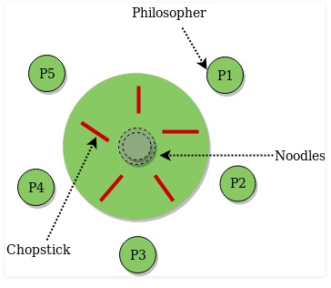
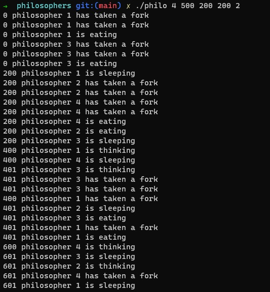
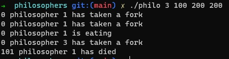

  What is it?
  -----------
  
  It's pedagogical project, that aims at studiying multithreading principles, by implementation of Dinning Philosophers Problem.
  In this project, i have learned the basics of threading a process, how to make treads, and discovered the mutex.
  
  Description
  -----------
  The Dining Philosopher Problem – The Dining Philosopher Problem states that K philosophers seated around a circular table with one chopstick
  between each pair of philosophers. There is one chopstick between each philosopher. A philosopher may eat if he can pick up
  the two chopsticks adjacent to him. One chopstick may be picked up by any one of its adjacent followers but not both. 
 
  

  
  Usage
  -----------
  
  To compile, run:
    ```
    make
    ./philosophers [number_of_philos] [time_to_eat] [time_to_sleep] [time_to_die] "[times_each_philo_must_eat]"
    ```
    
   Last argument is optional. Simulation will stop after each philo has eaten at least [times_each_philo_must_eat] times.
   If last argument is not presented, sumulation will stop only if one of philosophers dies.
    
   
   
   > Simulation will continue, before all philosophers eat 2 times.
   
   
   
   > Philospers dies, because they have not enouhg time to eat and sleep.
  
  
